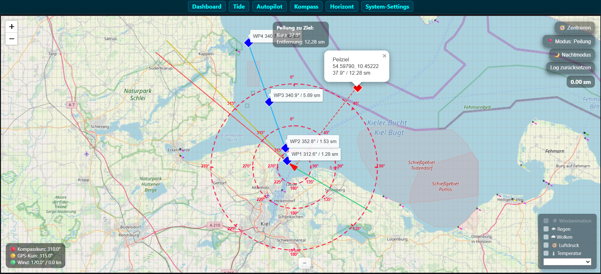
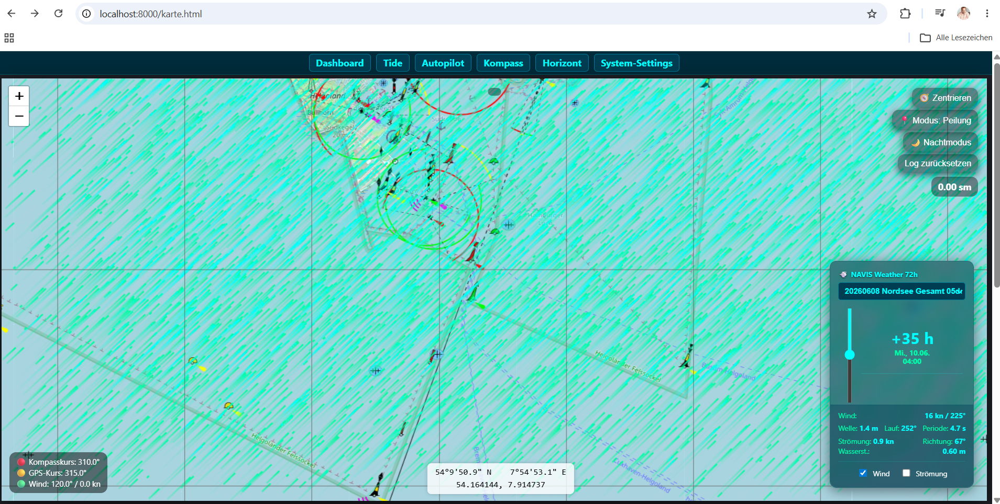
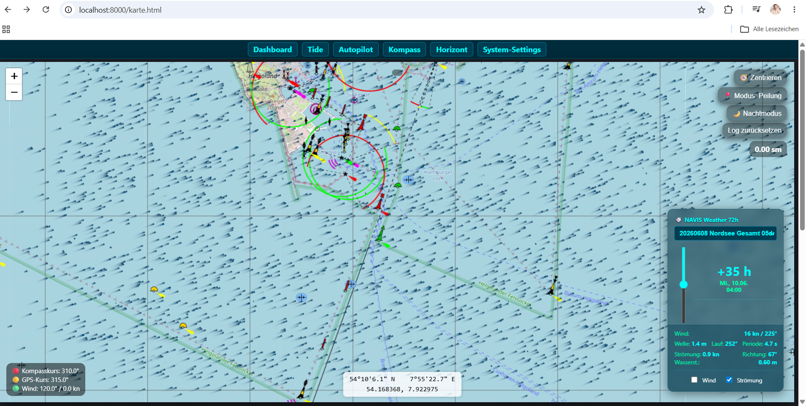
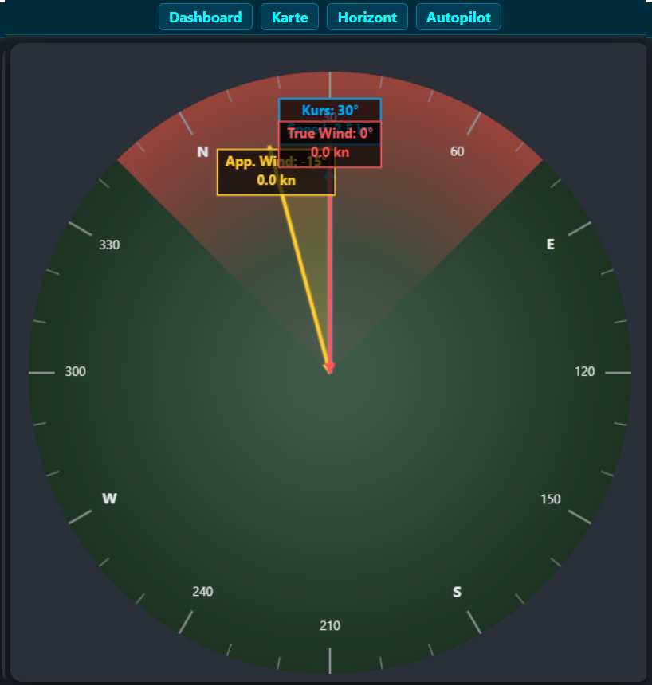
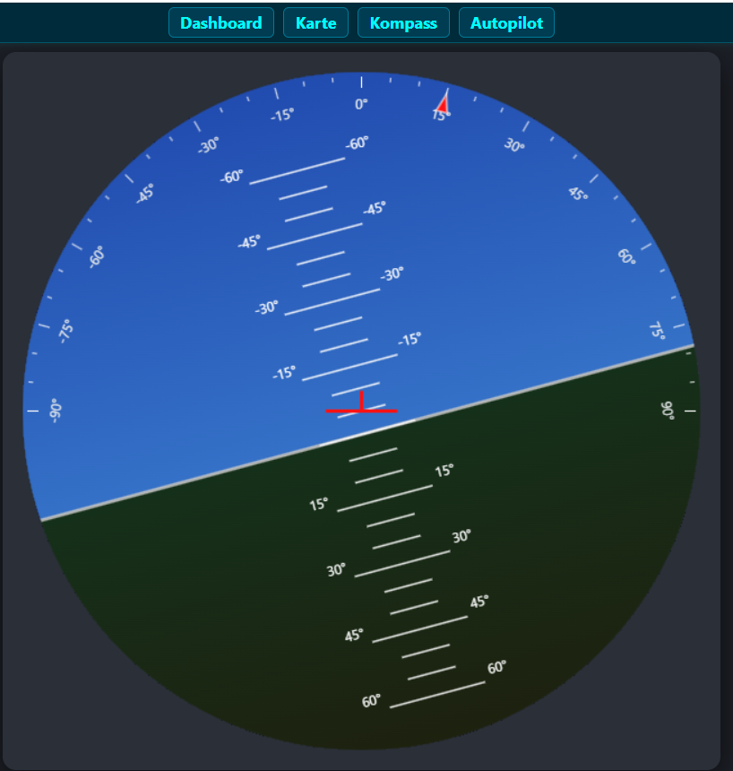

⛵ NAVIS — The Modular ESP32 Maritime Core & Autopilot Infrastructure
**Collaborative Development. Deployed Onboard. Real-Time Processing.**

This project features a highly optimized, marine-grade system architecture powered by the ESP32 microcontroller. Designed to serve as a low-power central navigation hub, NAVIS consolidates multiple decoupled marine electronics into a single hardware unit. It seamlessly aggregates electronic chartplotter interfaces, GNSS/GPS tracking, AIS reception, digital compass dynamics, an artificial horizon (AHRS), and comprehensive wind telemetry.

Built **by sailors, for sailors**, the entire infrastructure is fully modular, hardened against the rigorous environmental demands of blue-water routing, and operates completely platform-independent through any modern web browser.


Karte

Wettersystem


---

⚓ Key Mission-Critical Advantages Onboard

* **Ultra-Low Power & Resource Optimization:** Replaces a multi-device instrument stack with a single, highly efficient microcontroller. Minimizes current draw, which is vital for extended blue-water passages under sail where energy budgets are strictly limited.
* **Platform-Agnostic Responsive Web-UI:** Eliminates the dependency on proprietary or expensive marine displays. Deliver fluid data visualization to smartphones, ruggedized cockpit tablets at the helm, or navigation laptops at the chart table.
* **Air-Gapped Data Security & Zero-Connectivity Design:** Operates as a completely autonomous Wi-Fi Access Point. The system requires no cellular network or satellite internet connectivity to function flawlessly at sea.
* **Algorithmic Real-Time Optimization:** Employs advanced heading mechanics to handle the continuous $0^\circ \leftrightarrow 360^\circ$ quadrant transitions (wraparound), ensuring perfectly smoothed data visualization and preventing dangerous erratic inputs to connected steering systems.

---

🧠 Sensor Fusion & Signal Processing Deep-Dive

The primary challenge in marine telemetry is mitigating signal degradation caused by heavy seas, severe vessel heeling, pounding, and structural engine vibrations. To isolate the true motion of the vessel, the firmware processes raw sensor streams through multi-stage conditioning pipelines primarily located within `Sensor_Data.cpp/.h` and `IMU.cpp/.h`.

9-Axis Sensor Fusion & Attitude Heading Reference System (AHRS)
* **Vessel Motion Damping & Noise Filtering:** Dynamic wave impact introduces high-frequency mechanical noise into the raw roll and pitch telemetry (heel and trim). The system utilizes optimized complementary filters or Kalman filter states to isolate and suppress these transient impacts, delivering a clean, true attitude vector of the hull.
* **Tilt-Compensated Digital Compass:** Standard three-axis magnetometers quickly degrade in accuracy as the vessel heels over under sail. Our engine calculates a mathematical horizon by cross-referencing instantaneous accelerometer and gyroscope vectors from the IMU. This ensures the digital compass heading remains precise, even during sustained $30^\circ$ angles of heel.
* **Mathematical Quadrant Wraparound Handling:** When crossing the true North threshold (surpassing $359^\circ$ toward $0^\circ$), traditional averaging filters generate massive mathematical spikes or inverse calculation errors. The NAVIS mathematical engine intercepts these discontinuities natively, ensuring uninterrupted safety for downstream navigation loops and hardware autopilots.

GNSS Geodesy & Navigation Vectors
* **`GPS.cpp/.h`:** Beyond standard parsing of latitude and longitude coordinates, this module extracts and processes specific asynchronous NMEA sentences to calculate the true dynamic vector over ground, isolating Course Over Ground (COG) and Speed Over Ground (SOG).
* **Dynamic Magnetic Declination (`Mag_Dec.cpp/.h`):** To bridge the gap between geographic (True) North and Magnetic North, this component converts the raw measured magnetic heading into a valid True Heading (TH) using integrated look-up tables or mathematical spatial world magnetic models.




---

🖥️ User Interfaces & Hydrographic Chart Integration

The architecture strictly decouples the high-frequency instrument display layer from tactical map navigation rendering. The web frontend communicates asynchronously with the ESP32 core via lightweight network protocols.

Asynchronous Live Cockpit (Real-Time Telemetry)
* **Zero-Latency WebSockets:** Rather than relying on heavy, synchronous HTTP polling, the ESP32 pushes real-time sensor states (wind vectors, depth soundings, compass headings, heel angles) multiple times per second using minimized JSON payloads over a persistent WebSocket connection.
* **Hardware-Accelerated Visualization:** Utilizing HTML5 Canvas abstractions and native CSS3 transformations, the interface animates complex visual components like the compass rose or the pitch/roll gauges at native framerates without micro-stuttering, even on legacy, low-spec tablets mounted in the cockpit.

Chartplotter Subsystem & Layer Composition
The UI frontend includes an interactive geospatial map canvas powered by modern web mapping frameworks (e.g., OpenLayers or Leaflet), successfully compositing open-source layers with official hydrographic data:
* **OpenSeaMap Layer Integration:** Integrates the global, open-source marine mapping layer as a standardized tile layer. This brings crucial nautical data—including sector lights, buoyage, harbor layouts, and shallow water markers—which are cached systematically for offline routing.
* **Official BSH Cartography Support:** For critical navigation zones within the North and Baltic Seas, the interface supports official Web Map Services (WMS/WMTS) or locally rendered, pre-converted tile sets conforming to the Federal Maritime and Hydrographic Agency of Germany (BSH) standards. This guarantees strict compliance with official shipping channels and precise depth contours.
* **Mathematical AIS Target Overlay:** Target tracking data acquired from external Automatic Identification System (AIS) hardware modules is parsed, mathematically projected, and synchronized onto the active map coordinates. Each target vessel is rendered as a dynamic vector icon displaying its instantaneous course, heading, speed, and potential Closest Point of Approach (CPA).

---

📁 Repository & Project Architecture

* **`ESP32_Segelboot_AP/`** — Core workspace containing the root firmware files.
* **`ESP32_Segelboot_AP/src/`** — Hardware abstraction layers and modular C++ logic implementations (`GPS`, `IMU`, `AIS`, `Sensor_Data`).
* **`ESP32_Segelboot_AP/data/`** — Single Page Application (SPA) asset compilation (HTML5, production CSS, modular JavaScript) deployed directly to the microcontroller's flash allocation via a file system image.
* **`README.md`** — Comprehensive system documentation and operational manual.

---

🔧 Installation, Compilation & Hardware Provisioning

1. Source Acquisition
Clone the master repository and initialize all submodule dependencies into your local environment:
```bash
git clone https://github.com
```

2. Hardware Bill of Materials (BOM)
* **Microcontroller Unit:** ESP32 Development Board featuring enhanced flash storage (e.g., ESP32-WROOM-32E or ESP32-S3).
* **GNSS Receiver:** High-precision, NMEA-compliant GPS/GLONASS module (e.g., u-blox NEO-M8N) routed via a hardware serial interface (UART).
* **Inertial Measurement Unit (IMU):** 9-axis digital sensor with onboard fusion processing (e.g., Bosch BNO055 or MPU9250) communicating via the I2C bus.
* **Storage Peripherals:** SPI-attached SD card interface dedicated to high-frequency voyage data logging and local NMEA telemetry recording.

3. Firmware Deployment & Filesystem Flashing
* Launch the project within your integrated development environment (PlatformIO highly recommended).
* Execute the target environment's filesystem image build tool to compile and flash the `data/` directory content to the ESP32 using **LittleFS**. This provision step transfers the client-side UI application and default localized chart configurations.
* Compile and flash the primary application binaries to the microcontroller execution memory.

---

💡 Crucial Operational Notes for Marine Environments

* **Magnetic Deviation Mitigation:** Sailing vessels exhibit significant local magnetic signatures caused by inboard engines, steel keel bolts, battery banks, and standing rigging. If the IMU is installed near ferrous materials, it will inject massive errors into the heading calculation. It is mandatory to execute a calibration routine (steering steady, continuous circles in open water) post-installation to compute and persistently commit deviation offset tables directly via the Web UI.
* **Aggressive Offline Chart Caching:** Because reliable cellular or network connectivity is non-existent offshore, the web client utilizes advanced browser storage mechanisms, specifically localized Service Workers and indexed database caches. This ensures that previously loaded OpenSeaMap or hydrographic chart tiles remain fully accessible at the helm station when air-gapped from the internet.
---
---
---
---
⛵ NAVIS — Das modulare ESP32 Segelboot-Projektsystem
Gemeinsam entwickelt. Direkt auf dem Boot. Echt._ [1]
Dieses Projekt ist eine hochgradig optimierte, maritime Systemzentrale auf Basis des ESP32. Es vereint die Funktionen von Kartenplotter-Schnittstellen, GPS, AIS-Empfang, digitalem Kompass, künstlichem Horizont und Windsensorik in einer zentralen, stromspander Hardwarekomponente. [1, 2]
Das System ist von Seglern für Segler konzipiert: Vollständig modular aufgebaut, auf maximale Stabilität im harten Bordalltag getrimmt und plattformunabhängig per Webbrowser bedienbar. [1]

Kartenansicht

Wettersystem mit offline Wind und Wellen und Wasserströmungen.

________________________________________
⚓ Die entscheidenden Vorteile an Bord
•	Kompakt & Stromsparend: Ersetzt mehrere teure Einzelinstrumente durch einen einzigen Mikrocontroller mit minimalem Stromverbrauch (ideal für Langfahrt unter Segel).
•	Plattformunabhängig (Responsive Web-UI): Kein spezielles Display nötig. Egal ob Smartphone, Tablet (am Steuerstand) oder Laptop (am Navigationstisch) – der Zugriff erfolgt flüssig über jeden Browser.
•	Datensicherheit durch Offline-Konzept: Das System arbeitet als autarker WLAN-Access-Point. Es ist keinerlei Internetverbindung auf See erforderlich.
•	Echtzeit-Optimierung: Kurssprünge (Wraparound bei 0°/360°) werden algorithmisch abgefangen, um absolut saubere Anzeigen und Steuerbefehle zu garantieren. [1, 2, 3]
________________________________________
🧠 Sensorik & Signalverarbeitung (Deep-Dive)
Die größte Herausforderung an Bord ist die Signalqualität bei Seegang, Krängung und Vibrationen. Das System verarbeitet die Rohdaten der Sensoren daher in mehreren Stufen (Sensor_Data.cpp/h / IMU.cpp/h):
9-Achsen-Sensorfusion & Künstlicher Horizont
•	Dämpfung von Schiffsbewegungen: Roll- und Pitch-Werte (Krängung & Trimm) neigen bei Wellengang zum "Rauschen". Durch den Einsatz von komplementären Filtern oder Kalman-Filtern werden hochfrequente Störungen (z. B. Schläge durch Wellen) herausgefiltert. Zurück bleibt die echte, geglättete Lage des Bootes im Wasser.
•	Neigungskompensierter Kompass: Ein normaler Magnetometer-Sensor wird ungenau, sobald das Boot krängt. Unser System nutzt die Beschleunigungs- und Gyroskopdaten der IMU, um den mathematischen Horizont zu berechnen. Der Kompasskurs (Heading) bleibt dadurch auch bei 30 Grad Schräglage absolut präzise.
•	Mathematisches Wraparound-Handling: Bei Kursänderungen direkt im Norden (Übergang von 359° auf 0°) berechnen Standard-Filter oft fehlerhafte Sprünge. Die mathematische Engine fängt diesen Quadrantenwechsel sauber ab, um Fehlfunktionen in der Navigation und angeschlossenen Autopiloten zu verhindern. [1]
GPS & Navigations-Vektoren
•	GPS.cpp/h: Neben den reinen Längen- und Breitengraden extrahiert das Modul die NMEA-Sätze zur Berechnung des wahren Vektors über Grund.
•	Magnetische Deklination (Mag_Dec.cpp/h): Da der geografische Nordpol nicht dem magnetischen Nordpol entspricht, rechnet dieses Modul den gemessenen Magnetkurs (Magnetic Heading) anhand hinterlegter Tabellen oder mathematischer Modelle in den wahren Kurs (True Heading) um.


________________________________________
🖥️ User-Schnittstellen & Kartenmaterial-Integration
Die Benutzeroberfläche trennt die reine Instrumentenanzeige von der taktischen Navigation auf der Karte. Das Frontend kommuniziert asynchron über WebSockets mit dem ESP32 Core. [1]
Das Live-Cockpit (Echtzeit-Instrumente)
•	WebSockets für Latenzfreiheit: Anstatt die Seite permanent neu zu laden, pusht der ESP32 die Sensordaten (Wind, Tiefe, Kurs, Krängung) mehrmals pro Sekunde als schlankes JSON-Paket an den Browser.
•	Responsive Visualisierung: HTML5-Canvas und CSS-Transformationen animieren die Anzeigen (z.B. die Kompassrose oder die Neigungsanzeige des künstlichen Horizonts) absolut flüssig und ohne Ruckeln – selbst auf älteren Tablets am Steuerstand. [1, 2]
Kartenplotter-Schnittstelle & Kartenmaterial
Das System ist im Frontend für die Darstellung von interaktiven Seekarten vorbereitet (z.B. mittels OpenLayers oder Leaflet). Es kombiniert offene und amtliche Kartendaten:
•	OpenSeaMap Integration: Die kostenfreie, weltweite Open-Source-Seekarte wird direkt als Kachel-Ebene (Tile Layer) eingebunden. Sie liefert Leuchtfeuer, Betonnung, Hafenpläne und Flachwassergebiete, die über das WLAN geladen oder für den Offline-Betrieb gecacht werden können.
•	BSH-Kartenmaterial (Bundesamt für Seeschifffahrt und Hydrographie): Für Reviere in Nord- und Ostsee unterstützt die Benutzeroberfläche die Einbindung amtlicher WMS/WMTS-Dienste oder das Rendering entsprechend konvertierter BSH-Kacheln. Dies garantiert maximale Präzision bei Tiefenlinien und offiziellen Schifffahrtswegen.
•	AIS-Overlay: Die über das AIS-Modul empfangenen Daten anderer Schiffe werden mathematisch auf die GPS-Koordinaten der Karte projiziert. Jedes Ziel wird als dynamisches Icon mit Vektor (Kurs und Geschwindigkeit) direkt über der OpenSeaMap/BSH-Karte dargestellt.
________________________________________
📁 Projektstruktur
•	ESP32_Segelboot_AP/: Der Hauptordner für die Firmware.
•	ESP32_Segelboot_AP/src/: Enthält die .cpp und .h Dateien für die logischen Module (GPS, IMU, AIS, Sensor_Data etc.).
•	ESP32_Segelboot_AP/data/: Beinhaltet die Webserver-Dateien (HTML, CSS, JS), die via LittleFS in den Flash-Speicher geladen werden.
•	README.md: Diese Dokumentationsdatei. [1, 2]
________________________________________
🔧 Installation & Setup
1. Quellcode herunterladen
Klone das Repository in dein lokales Arbeitsverzeichnis:
git clone https://github.com
2. Hardware-Setup
•	Controller: ESP32 Development Board (z. B. ESP32-WROOM-32E oder ESP32-S3).
•	GNSS: NMEA-fähiges GPS/Glonass-Modul (z. B. NEO-M8N) via serieller Schnittstelle (UART).
•	Sensorik: 9-Achsen IMU (z. B. BNO055 oder MPU9250) via I2C für Neigung und Kompass.
•	Peripherie: SD-Karten-Slot (SPI) für die Reiseaufzeichnung. [1]
3. Firmware & Webinterface flashen
•	Öffne das Projekt in deiner bevorzugten IDE (z.B. PlatformIO).
•	Nutze das Dateisystem-Tool der IDE, um den Ordner data/ mittels LittleFS auf den ESP32 zu schreiben. Dadurch werden das Webinterface und die Basis-Kartenkonfigurationen übertragen.
•	Flashe anschließend den Programmcode auf den ESP32.
________________________________________
💡 Wichtige Praxis-Hinweise für den Bordbetrieb
•	Magnetische Ablenkung (Deviationsausgleich): Boote enthalten viel Metall (Motor, Kielbolzen, Wantenspanner). Wird die IMU in der Nähe montiert, verfälscht dies das Heading. Führe nach dem Festeinbau unbedingt eine Kalibrierungsfahrt (Kreise fahren) durch, um die Offsets über das Webinterface persistent zu speichern.
•	Offline-Karten-Caching: Da auf offener See kein Mobilfunknetz verfügbar ist, nutzt das Webinterface den LocalStorage des Browsers oder Service Worker, um einmal geladene OpenSeaMap-Kacheln für den Offline-Einsatz auf dem Tablet zwischenzuspeichern. [1, 2]
________________________________________
🚀 Roadmap / Nächste Schritte
•	Ausbau des Leaflet/OpenLayers Frontends zur direkten Speicherung von Offline-Kartenpaketen (mbtiles).
•	Erweiterung des NMEA0183- / NMEA2000-Outputs zur direkten Kopplung mit externen Autopiloten.
•	Integration einer Over-The-Air (OTA) Updatefunktion, um Software-Updates kabellos am Liegeplatz einzuspielen. [1, 2]

